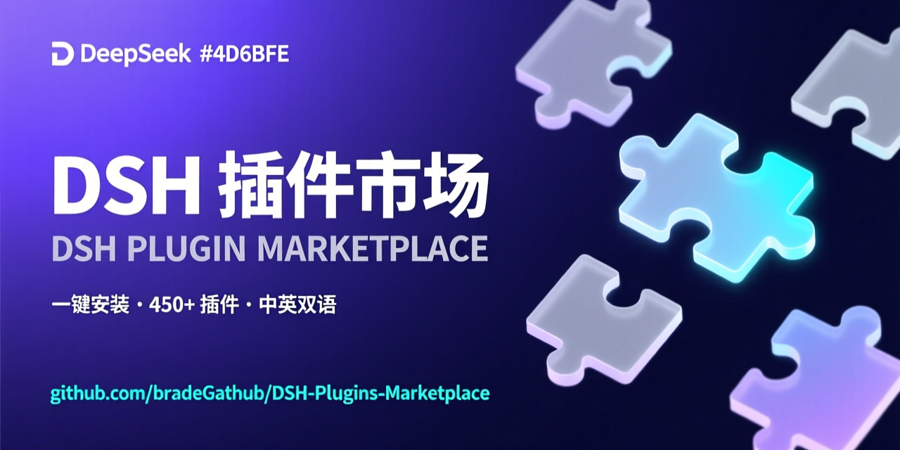

# DSH Plugin Marketplace · AI Edition (dsh-market-ai-recommend)

> 🚀 **This repository is a fork of [DSH-Plugins-Marketplace](https://github.com/bradeGithub/DSH-Plugins-Marketplace) (v1.5.5)** with a new **AI recommendation** system (daily picks + you-may-like + trending + new arrivals) and a **14-category** taxonomy (added Desktop Apps / Media & Audio). Package name stays `dsh-plugin-marketplace` — a drop-in replacement for the original.

🌐 **Language / 语言:** **English** | [中文](README.md)

A plugin marketplace for [DeepSeek Harness](https://github.com/deepseek-ai/deepseek-harness) (DSH): it auto-discovers **every** repository tagged with the [`dsh-plugin` topic](https://github.com/topics/dsh-plugin) on GitHub and shows them as cards in the Settings page of the DSH Web GUI — **one-click install / version detection / auto-update / installed recognition**, plus a built-in **AI recommendation engine** ("AI Picks" tab) that surfaces worth-trying plugins every day, with no command line required.

<p align="center">
  
  
  
  
  
  
  
  
</p>

<p align="center">
  
</p>

---

<!-- TOC -->
- [✨ Why this marketplace](#why-this-marketplace)
- [⚡ Quick install (copy & run)](#quick-install-copy-run)
- [🚀 Usage](#usage)
- [✨ Features](#features)
- [📦 Manual install](#manual-install)
- [🔧 How it works](#how-it-works)
  - [Data source (registry first, search API fallback)](#data-source-registry-first-search-api-fallback)
  - [Install pipeline (5 steps)](#install-pipeline-5-steps)
  - [Version detection logic](#version-detection-logic)
  - [Installed detection (five-way, auto-reconciled on every open)](#installed-detection-five-way-auto-reconciled-on-every-open)
- [📁 File structure](#file-structure)
- [📡 HTTP API](#http-api)
- [⚠️ Security notes](#security-notes)
- [⚖️ Disclaimer](#disclaimer)
- [🧱 Known limitations](#known-limitations)
- [🌱 Third-party ecosystem](#third-party-ecosystem)
- [🙏 Acknowledgements](#acknowledgements)
- [🛠️ Development & maintenance](#development-maintenance)
- [📝 Changelog](#changelog)
- [📄 License](#license)
<!-- /TOC -->

---

## ✨ Why this marketplace

<p align="center">
  <b>9500+</b> DSH plugins &nbsp;·&nbsp; <b>20000+</b> general Skills &nbsp;·&nbsp; <b>2 h</b> auto-ingestion &nbsp;·&nbsp; <b>0</b> API rate limits
</p>

| | Strength | Details |
|---|---|---|
| 🧠 | **AI recommendations** | The «AI Picks» tab: **Today's Picks** (generated by CI at 04:00 UTC daily — everyone sees the same set each day) + **You May Like** (content similarity from your installed plugins' categories/tags) + **Trending** + **New Arrivals** — every pick comes with a rule-based reason, fully offline-capable |
| 🔍 | **Complete coverage** | Auto-discovers **every** repo under the GitHub `dsh-plugin` topic (**9500+** and counting), plus a dedicated **20000+** general Skills column (`agent-skills` ∪ `claude-skills`) |
| 🤖 | **Auto-ingestion, zero paperwork** | CI incrementally scans the topic every 2 hours — tag your repo with `dsh-plugin` and it enters the marketplace within **2 hours at most**, no issue, no review queue |
| ⚡ | **Instant, rate-limit-free** | The list is served from a static registry via the jsDelivr CDN — thousands of plugins load instantly, end users make **zero GitHub API calls** |
| 🎯 | **Smart type detection** | Automatically detects and installs 4 repo types: cordis plugin / skill (SKILL.md) / agent preset / install script — source-built plugins get a build-confirmation prompt; plugins needing API keys pause and ask for material |
| 🔄 | **Version detection & one-click updates** | Installed version vs. latest repo version compared automatically — the button flips to «Update» when they differ; npm-published plugins compare against npm dist-tags (same-source, no false positives) |
| 🔒 | **Safety guardrails** | Risk confirmation before running third-party scripts; provided material is env-only and never persisted; minimal environment isolation; Host allowlist + CSRF header against cross-site forgery |
| 🏷️ | **Categories + community badges** | Build-time auto-categorization (**14 filter chips**, added Desktop Apps / Media & Audio); repos curated by awesome lists get a blue «Community listed» badge |
| 🌍 | **Bilingual** | UI and install logs follow DSH's language setting — 中文 / English |

> **Plugin authors, read [STANDARD.md](STANDARD.md)** ([English](STANDARD.en.md)): the marketplace-recognition spec — how to shape each plugin type (cordis plugin / skill / agent preset / script) so the marketplace detects, installs and updates it correctly, including the type-detection rules and known anti-patterns.

---

## ⚡ Quick install (copy & run)

**Option 1 (recommended): official dsh CLI** — installation and registration are handled by Harness's official mechanism (requires the `dsh` CLI and `pnpm`; `dsh web` users usually have both):

```bash
dsh plugin --profile web install sanniuPUMC/dsh-market-ai-recommend
```

Uninstall / update use the same official commands:

```bash
dsh plugin --profile web remove sanniuPUMC/dsh-market-ai-recommend
dsh plugin --profile web install sanniuPUMC/dsh-market-ai-recommend   # reinstall = update
```

**Option 2: install script** (for environments without the dsh CLI; the script automatically switches to the official method when it detects the CLI):

| Platform | Command |
|---|---|
| Windows (PowerShell) | `irm https://raw.githubusercontent.com/sanniuPUMC/dsh-market-ai-recommend/main/install.ps1 \| iex` |
| macOS / Linux | `curl -sL https://raw.githubusercontent.com/sanniuPUMC/dsh-market-ai-recommend/main/install.sh \| bash` |

**One sentence to hand to an AI** (any AI with command execution works — no further explanation needed):

> Install the DSH plugin marketplace (dsh-plugin-marketplace): run `dsh plugin --profile web install sanniuPUMC/dsh-market-ai-recommend`; if there is no dsh CLI, clone https://github.com/sanniuPUMC/dsh-market-ai-recommend into ~/.dsh/profiles/web/node_modules/dsh-plugin-marketplace and register it in ~/.dsh/profiles/web/cordis.patch.yml (id: plugin-marketplace, name: dsh-plugin-marketplace), then restart dsh web.

> ⚠️ **Migrating from the original**: this fork shares the package name `dsh-plugin-marketplace` with [DSH-Plugins-Marketplace](https://github.com/bradeGithub/DSH-Plugins-Marketplace) — if you have the original installed, run `dsh plugin --profile web remove bradeGithub/DSH-Plugins-Marketplace` **first**, then install this repo to avoid a package-name clash.
> ⚠️ The script commands download and run the install script from this repo (copies the plugin and registers it in `cordis.patch.yml`) — trust-to-execute. It is recommended to **review the script first** before executing it (`irm <url> | iex` / `curl <url> | bash` is a well-known remote-code-execution pattern). The official CLI method performs the installation inside Harness itself, without running third-party scripts.
> After installing, **restart DSH** (re-run `dsh web`) and refresh the page.

---

## 🚀 Usage

1. Restart DSH, open the Web GUI and go to **Settings → DSH Plugin Marketplace**
2. The page auto-loads all plugins (installed first, then sorted by stars); click «Refresh» to force a re-fetch
3. Use the search box to filter plugins by name; category chips filter by column
4. Click the button on a plugin card:
   - **Install** → starts installation with a live-scrolling log
   - Material needed → an input dialog appears; provide the API key etc. and click «Submit and continue install»
   - **Update** → overwrite-upgrade when a newer version is detected
   - **Installed** (grey) → nothing to do
5. Switch to the **AI Picks** tab: **Today's Picks** (same set for everyone each day, auto-rotates daily) + **You May Like** (similarity from your installed plugins' categories/tags) + **Trending** + **New Arrivals** — every card carries a recommendation reason and can be installed directly
6. Switch to the **General Skills** tab to browse 20000+ skills with search / infinite-scroll pagination / one-click install

---

## ✨ Features

- **AI recommendations (new in this fork)**: the «AI Picks» tab aggregates four groups —
  - **Today's Picks**: CI deterministically rotates 8 picks daily at 04:00 UTC from a quality pool (star floor + community/verified badges + toy-repo filtering) with category diversity; the client prefers the `daily-picks.json` CDN file and falls back to the identical local algorithm when it is stale/unavailable
  - **You May Like**: content-similarity recommendations from a **category + tag profile** of your installed plugins, with reasons such as "you installed the same category" or "related to your tags"; new users are guided to install something first
  - **Trending**: composite score of log-stars + recency + community/verified badges
  - **New Arrivals**: plugins first indexed within the last 14 days, sorted by stars
  - Everything is **computed offline with zero API calls**; recommendation cards reuse the full card component (install / uninstall / update buttons included)
- **Full fetch**: the plugin list is served primarily from a **static registry** (`registry.json`, distributed via the jsDelivr CDN and regenerated every 2 hours by GitHub Actions) — zero API calls, zero rate limits, instant even with thousands of plugins; when the registry is unavailable it automatically falls back to paging the GitHub search API (10-minute cache). List order: **installed plugins first**, then the rest sorted by star count descending
- **One-click install**: each card has an «Install» button that automatically runs: clone repo → detect type → scan required env vars → install
- **Built-in quick install**: this repo ships `install.ps1` / `install.sh` — install with a single command, or hand the one-liner above to any AI
- **Smart type detection**: automatically detects and installs the following repo types:
  - `skill` (contains `SKILL.md`) → installed to `~/.dsh/skills/`
  - agent preset (contains `preset.yml` + `agent.cordis.yml`) → installed to `~/.dsh/.agent-presets/`
  - cordis plugin (contains `package.json`) → installs dependencies and registers into the web profile
  - install script (`install.sh` / `install.ps1`) → executes the script
- **User input interception**: when a plugin needs env vars like `API_KEY` / `TOKEN` / `SECRET`, **installation pauses automatically** and an in-page dialog asks you for the material (or you can skip) — never installs blind
- **Script execution confirmation**: when a third-party install script (`install.sh` / `install.ps1`) or an npm lifecycle script (`prepare` / `install` / `postinstall`, etc.) is detected, asks for your confirmation first — declining cancels the install and **cleans up all traces**
- **Installed recognition**: five-way detection — install manifest (`installed.json`) + directory heuristic probing + package-name mapping scan + self-identification via the plugin's own `repository` field + clone-cache pre-read; installed plugins show a disabled grey «Installed» button
- **Bilingual**: the UI and install logs follow DSH's language setting — 中文 / English (Settings → General → Language)
- **Version detection & updates**: cordis plugins compare the installed version against the latest version of the repo (read from the local cache, zero extra network requests); when they differ the button turns into «Update» — click to overwrite-upgrade
- **Search**: real-time filtering by plugin name / full repo name / tags
- **Category**: build-time auto-categorization from description/tags (**14 categories**: vision / document / memory / model / notify / coding / conversation / web-ui / agent / tool / resource / desktop / media / other — Desktop Apps & Media & Audio are new in this fork, absorbing launcher/tray/pet and audio/video/voice repos out of the oversized "other" bucket), filter chips in the UI + category badges on cards
- **Community badge**: the build fetches awesome lists (default: [awesome-dsh-plugin](https://github.com/awesome-dsh-plugin/awesome-dsh-plugin), community-curated) and stamps a blue «Community listed» badge on intersecting repos (tooltip explains the source) — quick recognition of community-recognized plugins (listing ≠ endorsement by this marketplace)
- **General Skills column**: switch to the «General Skills» tab in Settings — browse the CI-built skills index (`agent-skills` ∪ `claude-skills`, 20000+ repos) with search / paginated infinite scroll / one-click install to `~/.dsh/skills/` / installed recognition; repos with install scripts carry a 🛡 badge, unverified probes show a weak «unverified» hint
- **Refresh feedback**: click «Refresh» to force a re-fetch, with a toast confirming «refresh succeeded / refresh failed»
- **GitHub link**: every card links to the original repo (opens in a new tab)
- **Dark/light themes**: built entirely on DSH theme tokens (`--dsw-alias-*`), adapting automatically
- **Self-exclusion**: `deepseek-harness` (DSH's own repo, not a plugin) is hard-coded excluded

---

## 📦 Manual install

> 💡 Prefer no manual steps? Use the [⚡ Quick install](#-quick-install-copy--run) section above (a single command, or the one-liner handed to an AI).

The plugin lives at `~/.dsh/profiles/web/node_modules/dsh-plugin-marketplace/` and is registered via `~/.dsh/profiles/web/cordis.patch.yml`:

```yaml
- insert:
    - id: dsh-plugin-marketplace
      name: dsh-plugin-marketplace
```

> ⚠️ **Restart required**: the DSH web profile has configuration hot-reload disabled (`hmr` off). After changing plugin code or registration entries you need to **restart DSH** (re-run `dsh web` or `start-dsh.bat`) and then refresh the page.

---

## 🔧 How it works

### Data source (registry first, search API fallback)

```
GitHub Actions (every 2 hours, repo's own token)
   └─ scripts/build-registry.mjs: pages topic:dsh-plugin, incremental merge, dedupe/self-exclude
        └─ commits registry.json back to main (9500+ plugins, sorted by stars)
             └─ plugin reads: jsDelivr CDN (fast in CN) → raw.githubusercontent (fallback)
                  └─ only if all sources fail: GitHub search API (paged, 10-min cache)
```

- The registry is generated by CI, so end users make **zero API calls and hit no rate limits**; new plugins appear within two hours at most
- The registry only contains repo metadata (name / description / stars / updated_at / topics / license); installing still clones directly from `github.com`

### Install pipeline (5 steps)

```
[1/5] git clone repo to ~/.dsh/marketplace/cache/<owner>__<name>/
[2/5] Detect type (SKILL.md / agent preset / install script / package.json)
[3/5] Scan README / install scripts / .env examples for env vars (API_KEY etc.)
      └─ found → pause installation, wait for user material (skippable)
[4/5] Perform install (copy skill / preset / plugin package, or run install script)
      └─ script type → ask for user confirmation first (third-party code risk)
[5/5] Write the install manifest (installed.json) and return the result
```

### Version detection logic

| Data | Source |
|---|---|
| Installed version | `installed.json` record; for legacy installs without a record, read the install dir's `package.json` |
| Latest version | the registry index `version` field first (refreshed by CI every 2 hours); falls back to the market cache clone's `package.json` when the index lacks it; npm-published plugins (cli) compare against npm dist-tags (`npm_version`) same-source |

When both exist and differ → the card shows an «Update» button plus `installed vX → vY`.
(Only applies to cordis plugins containing `package.json`; skills / presets / script types have no version concept.)

### Installed detection (five-way, auto-reconciled on every open)

1. `~/.dsh/marketplace/installed.json` install manifest (installed via this plugin)
2. Directory heuristic probing: `~/.dsh/skills/<name>`, `~/.dsh/.agent-presets/<name>`, market cache clone
3. Package-name mapping: scans the `package.json` names of installed directories (including scoped `@scope/name` packages) and compares them against the repo name / raw repo name / registry package name (`pkg_name`) — repos whose name differs from the package name (e.g. `DSH-Plugins-Marketplace` → `dsh-plugin-marketplace`) are still recognized, and the installed version is read correctly
4. **Repository ownership check (both directions)**: the installed package's `repository` field must match the target repo — this prevents false positives for same-named repos from different owners, and enables reverse matching (plugins installed before the marketplace are correctly flagged as installed, even for scoped packages or large name differences)
5. Self-identification: a repo matching this plugin's own `repository` field in `package.json` counts as installed (the market never shows its own repo as «Install»)

> **Official plugins are auto-excluded**: DSH's built-in official plugins (`@deepseek-ai/*`, discovered at runtime from the install directory plus a fallback list) are never treated as user-installed marketplace plugins and are never mis-flagged as installed.

---

## 📁 File structure

```
~/.dsh/
├── profiles/web/
│   ├── node_modules/dsh-plugin-marketplace/   ← this plugin
│   │   ├── package.json        (dsh.client declaration + exports)
│   │   └── lib/
│   │       ├── index.js        (server: GitHub fetch / install pipeline / version detection)
│   │       └── client.js       (client: marketplace page UI)
│   └── cordis.patch.yml        (plugin registration entry)
└── marketplace/
    ├── cache/<owner>__<name>/  (clone cache; data source for install & version comparison)
    └── installed.json          (install manifest: type / name / location / version / installedAt)
```

---

## 📡 HTTP API

| Endpoint | Method | Description |
|---|---|---|
| `/api/marketplace/list` | GET | Plugin list (star-descending, with `installed` / `installedVersion` / `latestVersion` / `updateAvailable`, `source` data source, `dropped` hidden-duplicate count); `?refresh=1` forces a re-fetch |
| `/api/marketplace/recommend` | GET | AI recommendations (new in this fork): `{ date, hasInstalled, guess, trending, fresh, daily, dailySource }` — guess is content-similarity from the installed-plugin profile; daily prefers the CI-generated `daily-picks.json` (CDN), `dailySource` is `ci` or `local`, with an identical local deterministic algorithm as fallback; `?refresh=1` forces a refresh |
| `/api/marketplace/skills` | GET | General skills list (from `skills.json`, filtered to `has_skill !== false`, with `installed` / `installedAt`); `?refresh=1` forces a re-fetch |
| `/api/marketplace/install` | POST | Install / update, body: `{ "repo": "owner/name", "answers": { "ENV_NAME": "value" } }`; returns `done` / `awaiting-input` / `aborted` / `failed` / `manual` status + step-by-step log |
| `/api/marketplace/uninstall` | POST | Uninstall, body: `{ "repo": "owner/name" }`; removes the install dir / package dir + `cordis.patch.yml` entry + install record; returns `done` (with `removed` count and log) |
| `/api/marketplace/self-update` | GET | Marketplace self-update check (`{ installedVersion, latestVersion, updateAvailable, checkedAt }`) |
| `/api/marketplace/self-update` | POST | Perform the marketplace self-update (official CLI install + post-install version verification); returns `no-update` / `done` / `failed` |
| `/api/marketplace/check-update` | POST | Manual version check for npm-type cli plugins (body `{ repo }`; queries the npm registry, npmmirror first); returns `done` + `updateAvailable` / `latestVersion` |
| `/api/marketplace/feedback` | POST | Submit install feedback (body `{ repo, ok, note }`) → dequeued and synced into a GitHub issue; returns `done` (with `issueUrl` / `manualUrl`) |
| `/api/marketplace/feedback/pending` | GET | Pending feedback queue (`{ pending: [...] }`) |
| `/api/marketplace/feedback/token` | GET / POST | Read / write the GitHub token config (write body `{ token }`, empty string clears; returns `hasToken`) |
| `/api/marketplace/env-keys` | GET | Configurable env-var key names of an installed plugin (values never echoed); query `?repo=` |
| `/api/marketplace/env-edit` | POST | Write plugin env vars (body `{ repo, values }`, persisted to `~/.dsh/.env` + `envs.json`); returns `done` + `applied` |
| `/api/marketplace/backup` | GET | Export install-record backup (`{ backup: { repos: [...] } }`) |
| `/api/marketplace/restore/diff` | POST | Compute the restore diff for a given backup (body `{ backup }`; returns `missing` / `already`) |
| `/api/marketplace/backup/webdav` | POST | Push backup to WebDAV (body `{ url, username?, password? }`) |
| `/api/marketplace/restore/webdav` | POST | Pull backup from WebDAV and return the restore diff |
| `/api/marketplace/logs` | GET | Export sanitized install logs (`{ text, count }`) |

> Notes:
> - Uninstall relies on the `installed.json` record — plugins **installed via this marketplace** can be fully uninstalled; plugins pre-installed manually (outside the marketplace) are only recognized as «installed», with no uninstall button.
> - All write operations (install / uninstall / self-update POST / feedback / feedback-token POST / env-edit / webdav push & pull) share the same auth: loopback requests pass directly; LAN requests require `lanWrite: true` config + the session token (`x-dsh-marketplace-token` header).

---

## ⚠️ Security notes

- Installing means trusting the repo: install scripts (`install.sh` / `install.ps1`) can **execute arbitrary code** on your machine; the market asks for confirmation before running them
- API keys and other material you provide are passed only as **environment variables for that installation** and are never written to any persistent file (except what the install script itself does)
- Third-party install scripts run with a **minimal environment** (basic system variables + the material you submitted); npm dependency installs strip all secret-class variables — `process.env` is never leaked wholesale to plugin code
- The install endpoint only accepts trusted origins: requests must carry the `X-DSH-Marketplace` header and the Host must be in the **allowlist** (loopback / private LAN ranges / extra hosts via the `DSH_MARKETPLACE_ALLOWED_HOSTS` env var), protecting against cross-site forgery and DNS rebinding
- Plugin packages are copied into the web profile and registered in `cordis.patch.yml` — they load with every DSH startup, so only install repos you trust

---

## ⚖️ Disclaimer

- This marketplace only provides **discovery and installation convenience**: every plugin listed comes from a third-party GitHub repository, developed and maintained independently by its authors, and is **not affiliated with DeepSeek Harness or this marketplace in any way**
- The marketplace makes **no express or implied warranty** about the quality, reliability, security, usability, or fitness of any plugin — including but not limited to code quality, license compliance, data privacy, malicious behavior, and compatibility
- A plugin appearing in the index **does not constitute any recommendation or endorsement**; installing means you have evaluated and accepted the risks yourself. Review the repo's source and README before installing
- This marketplace is provided **AS-IS**. The marketplace and its developers accept **no liability** for any direct or indirect loss (including data loss, system damage, privacy leaks, etc.) caused by installing or using any third-party plugin

---

## 🧱 Known limitations

- **Security model**: the install endpoint has no user authentication; protection relies on **local-network isolation plus a CSRF header check, a Host allowlist (loopback / LAN / configurable) and an Origin check** — do not expose the DSH web port to untrusted networks. Installing means executing third-party code on your machine (npm dependencies and install scripts); only install repos you trust and have reviewed
- The whole install task is attached to a single POST request (clone + npm install + build + material-confirmation loops); a short-timeout reverse proxy in front of DSH (default 60 s) may cut the connection — the backend task keeps running, refresh the page to confirm the result
- Version detection only works for plugins with `package.json`; skills / presets / script types have no version concept; authors who never bump `version` won't trigger update hints
- The plugin list is served from the static registry (CDN) by default; the GitHub search API is used only when both registry sources are unreachable, and its unauthenticated limit is **10 requests/minute** — clicking «Refresh» too often during fallback may hit the limit (the UI will report refresh failure — wait and retry)
- **Skills index scope**: full index since v1.3 — Search API «stars segments + time-window bisection» breaks the 1000-results-per-query cap, covering all repos of `agent-skills` ∪ `claude-skills` (20000+ currently); `has_skill` probing fills in batches under the Core API quota (CI resumes incrementally every 2 hours; unprobed repos show a «unverified» hint)
- **Index update cadence**: both indexes are incrementally rebuilt by CI every 2 hours (repos pushed in the last 3 days, capturing new repos / stars / updated_at instantly) and merged with the old index; a full rebuild at 04:00 UTC daily refreshes star counts
- «Installed» recognition for script-type plugins is based on cache-dir existence; after deleting the cache it will show as installable again
- The «Community listed» badge comes from a third-party awesome list (default [awesome-dsh-plugin](https://github.com/awesome-dsh-plugin/awesome-dsh-plugin)); if the list fetch fails, that build doesn't update the badge (incremental builds keep the old stamp, the next build recovers); listing does not represent this marketplace's endorsement
- Temp-dir / supply-chain notes for the install script are in the `install.sh` header (unsigned tarballs are an inherent limitation of the curl|bash pattern)
- Plugin code changes require a **DSH restart** to take effect (the web profile's HMR is disabled)

---

## 🌱 Third-party ecosystem

[Harness Desktop](https://github.com/baiyuscc13724-max/deepseek-harness-desktop) is a third-party, community-maintained Windows desktop app. Its stable release includes this marketplace, so users can browse, install, and update community plugins from **Settings → DSH Plugin Marketplace** without using the command line.

This entry was submitted by the Harness Desktop author, who also maintains the DSH-Plugins-Marketplace fork used by the desktop app. Harness Desktop has no official affiliation with this repository or DeepSeek.

Also, [awesome-dsh-plugin](https://github.com/awesome-dsh-plugin/awesome-dsh-plugin) is the community-maintained curated list of DSH plugins that powers this marketplace's "community curated" badge; the marketplace has likewise submitted a mutual-link listing PR to that list.

---

## 🙏 Acknowledgements

**Code contributors**:

- [lgnorant-lu](https://github.com/lgnorant-lu) — write-endpoint auth (loopback socket check), security hardening (PR #63, twelve fixes), the mechanized testing system (PR #66: mutation/property/i18n), SkillsTab fixes, and many more core contributions
- [baiyuscc13724-max](https://github.com/baiyuscc13724-max) — Harness Desktop marketplace integration and install-flow simplifications (#1/#2)
- any / bubble / tatakaria — early contributions

**Ecosystem collaborators** (discussion #2269, recognition/verification/compliance alignment):

- [qing3a](https://github.com/qing3a) (dsh-plugin-verify) — verification-layer field contract and open-data layer, powering the "✓ verified" badge
- [wwumit](https://github.com/wwumit) (skills-catalog / skill-compliance) — disclosure-layer field contract, catalog open-data layer and self-check ruleset, powering the "disclosed ✓" badge
- [ylwl1997](https://github.com/ylwl1997) (dshbase) — directory-gate mutual recognition
- the awesome-dsh-plugin maintainers — mutual listing (PR #994) and the verification-field RFC (#1176)

**Every reporter**: every user who filed install feedback or issues — your reports directly drive the v1.5.x fix cadence.

**Fork acknowledgement (this repo)**: a fork of [DSH-Plugins-Marketplace](https://github.com/bradeGithub/DSH-Plugins-Marketplace) by [bradeGithub](https://github.com/bradeGithub); the AI recommendation engine (`lib/recommend.js`), the daily-picks CI (`daily-picks.json`) and the 14-category taxonomy are new here. All original code and contributions keep their MIT attribution.

Want to contribute? See [docs/CONTRIBUTING.md](docs/CONTRIBUTING.md) and the [STANDARD.md §7 self-check list](STANDARD.en.md).

---

## 🛠️ Development & maintenance

- Server-side logic: edit `lib/index.js` (syntax check: `node --check`)
- Recommendation engine: edit `lib/recommend.js` (pure functions shared by the server and the CI daily-picks script; after changes run `node scripts/tests/unit/recommend.test.mjs`)
- Log redaction: edit `lib/redact.js` (multi-layer sanitization before install logs go to public issues — keys / paths / context-adjacent / entropy fallback; rule pairs maintained in [docs/TESTING.md](docs/TESTING.md))
- Page UI: edit `lib/client.js` (browser bundle, `window.__ModuleLoader__.load` format; `require` resolves DSH platform modules)
- Category rules: edit `CATEGORY_RULES` / `CATEGORY_OVERRIDES` in `scripts/build-registry.mjs` (adding a category requires syncing three places: the rule id ↔ `CATEGORY_KEYS` in `lib/index.js` ↔ `CATEGORY_KEYS` + the `cat*` i18n keys in `lib/client.js`, plus updating `audit-expected.json` expectations)
- Restart DSH for changes to take effect; the client bundle's revision (`rev`) is content-hashed, and the browser fetches the new version automatically after a restart
- **Plugin authors, read [STANDARD.md](STANDARD.md)** ([English](STANDARD.en.md)): the marketplace-recognition spec — how to shape each plugin type (cordis plugin / skill / agent preset / script) so the marketplace detects, installs and updates it correctly, including the type-detection rules and known anti-patterns.
- Install-feedback system (auto-created issue template / fields / redaction / privacy boundaries) in [docs/FEEDBACK.md](docs/FEEDBACK.md); documentation index in [docs/README.md](docs/README.md)

---

## 📝 Changelog

See [docs/CHANGELOG.md](docs/CHANGELOG.md) for the full version history (all versions before v1.0.0 are part of the beta series).

---

## 📄 License

MIT

